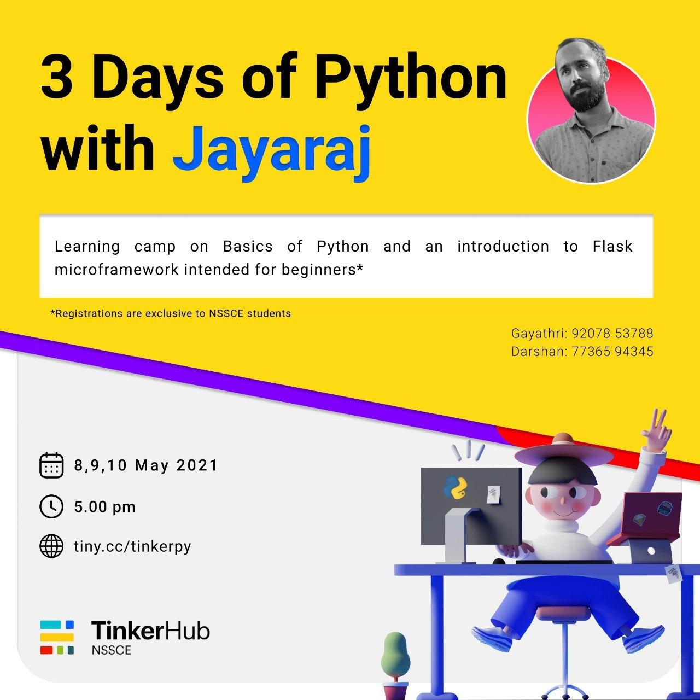
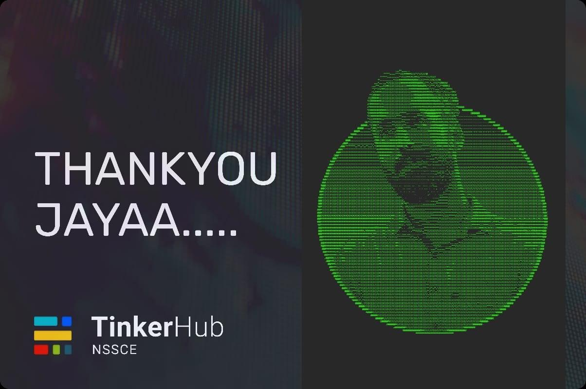

## The Start

It all started with a message from one of my friend. At first, I never wanted to take any online session. On second thoughts and after a lot of pressure from my own friends, I agreed to take the 3 day session. My first webinar, that too formulated into a 3 day workshop. It was on my nerves. I'm very much concerned regarding, how the participants would percieve me. I wanted everyone to learn the basics at the same time not to get bored.

Anyway, my event got published by our Tinkerhub NSSCE team. I thought it won't receive much response, as the team was not very popular in campus. But, after a while, the registration has been booming and got to be 100+ in very short time.

The workshop was scheduled to be on 8, 9, and 10th of May. As we all knows, the situation permits only online mode. I want to train complete newbies, and should introduce them to one of the most popular language, that too in very short time.

The things I should keep in mind was:

 1. I should assume, participants won't have any prior knowledge with any programming language 

 2. After covering the basics, I must also introduce them to the Flask framework 

 3. Especially in this crisis period, we cannot make sure everyone has the same mindset, they can be easily disturbed, or get bored 

With these things in mind I have started creating the presentation for the workshop.

## Day 1
The group has seen a whopping 100 participants.The event was decided to be hosted on AirMeet. As the interface was a little bit cluttery, I have managed to make a good start.

Day 1 has been started by narrating a brief history about Python, and an introduction to programming. Spoke about the idea behind Python, licensing, open source concept, about the founder Guido Van Rossum etc, I continued to convey about the simplicity and core functionalities of Python, like its extensibility, scripting, embeddability and more. The participants might have got a clear idea of what are the benefits of learning Python.

After that, I have started with Python basic data types. Huh, hmm.. shown how to print ("Hello world") to the participants, and they where like, curious to know what is happening there.

## Day 2

will add more.....

## Day 3: The end

Third day saw introduction to object oriented programming using Python and some basic intro to Flask. The participant count has been less, and was gradually decreasing from day 1. I think, as the advanced concepts in Python might have been somewhat difficult, or the students might have found it as boring.

